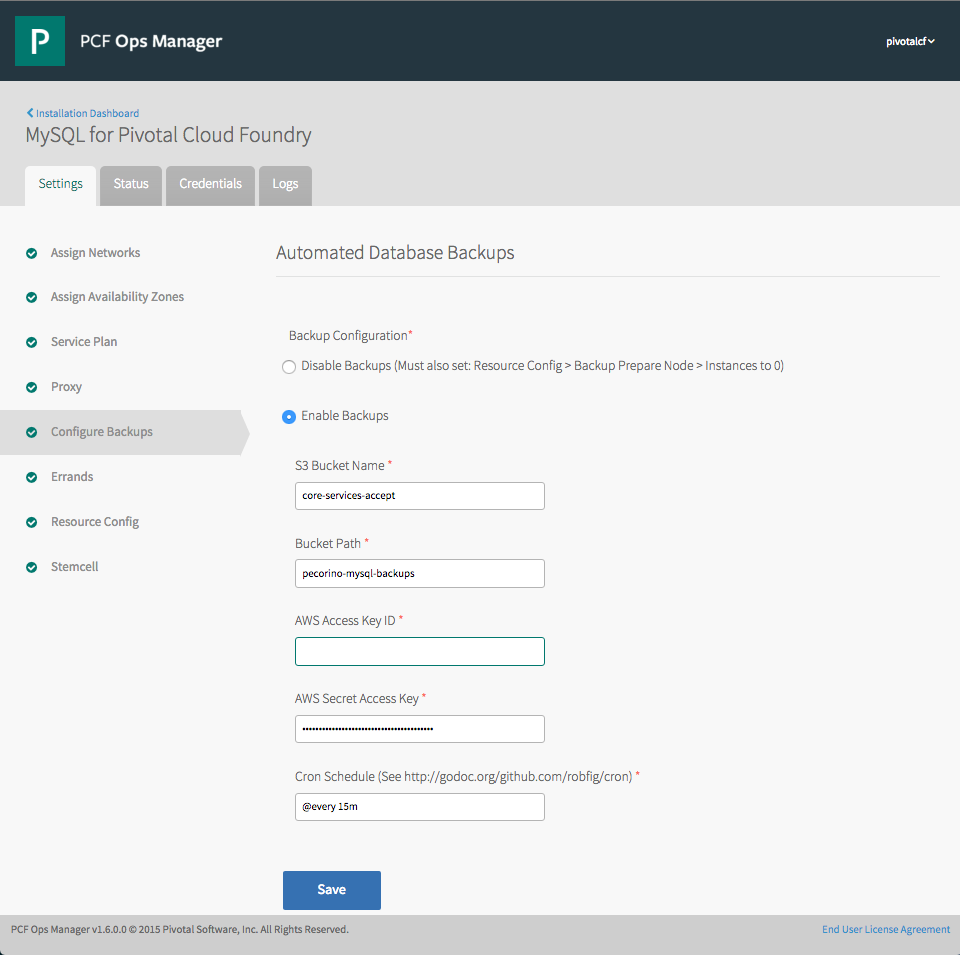

# Automated Backups
In versions of p-mysql 1.7.0.0 and higher, automated backups can be enabled in the "Configure Backups" section. Backups enable the following features:

- Periodically create and upload backup artifacts suitable for restoring the complete set of database instances allocated in the service.
- No locks, no downtime. The only affect on the serving systems is the amount of I/O required to copy the database and log files off of the VM.
- Includes a metadata file which contains the critical details of the backup artifact, including the effective calendar time of the backup.
- Backup artifacts are encrypted within the p-mysql cluster of VMs; clear data is never transported outside of the p-mysql deployment.
- Backups are currently stored on Amazon S3. Other storage targets will be added over time.



Backups are enabled by default. If you do not wish for this deployment to be backed up, you must disable backups in three steps:

1. Select "Disable Backups" in the Configure Backup section.
1. Switch to "Resource Config," section, and change the number of instances for `Backup Prepare Node` from 1 to 0.
1. Return to the Installation Dashboard, and click `Apply Changes`.


## Configuring Backups Step-by-Step
For each step, refer to the screenshot above.

1. Select "Enable Backups"
1. Enter an bucket name for the backups to be uploaded. Using the S3 credentials below, p-mysql will automatically create the bucket if it does not exist.
1. Enter a folder name for this cluster's backups to be stored. Again, the folder will be automatically created if it does not exist. **It is important to use this folder exclusively for this cluster's backup artifacts.** Mixing the backup artifacts from different clusters within a single folder can cause confusion and possible inadvertant loss of backup artifacts.
1. Provide an AWS Access Key and Secret Access Key in the following fields. We recommend that you create an [IAM](https://aws.amazon.com/iam/) credential that only has access to this bucket.
1. Specify how often you'd like backups to occur in the final field, "Cron Schedule." The [syntax definition](http://godoc.org/github.com/robfig/cron) is similar to traditional cron, plus easy features such as, `@every 1d` to back up once per day.


## Understanding Backup Metadata
Along with each release, p-mysql will upload a `mysql-backup-XXXXXXXXXX.txt` file. The contents of that file will look something like this:

```
uuid = dfe9fcdd-7d0f-11e5-93b3-0695a7b9771f
name =
tool_name = innobackupex
tool_command = --user=root --password=... --stream=tar tmp/
tool_version = 1.5.1-xtrabackup
ibbackup_version = xtrabackup version 2.2.10 based on MySQL server 5.6.22 Linux (x86_64) (revision id: )
server_version = 10.0.21-MariaDB-wsrep
start_time = 2015-10-28 01:04:40
end_time = 2015-10-28 01:04:43
lock_time = 1
binlog_pos =
innodb_from_lsn = 0
innodb_to_lsn = 1730899
partial = N
incremental = N
format = tar
compact = N
compressed = N
encrypted = N
```


## Restoring a Backup Artifact

The process to restore a backup artifact to a p-mysql cluster is currently entirely manual. Follow these steps to make the data stored offsite available anywhere that you hae p-mysql installed.

- Discover the encryption keys in the `Credentials` tab of the p-mysql tile.

1. Reduce the size of the cluster to a single node
    1. Select P-MySQL tile > Settings > Resource Config > MySQL Server > Instances, and set to 1
    1. Click "Save"
    1. "Back to Installation Dashboard" > Apply Changes
    1. Wait for deployment to succeed
1. Prepare the first node for restoration
    1. [ssh](https://docs.pivotal.io/pivotalcf/customizing/trouble-advanced.html#ssh) onto the OpsManager Director
    1. From there, use BOSH to the[ssh](https://docs.pivotal.io/pivotalcf/customizing/trouble-advanced.html#bosh-ssh) onto first mysql job
        - IP address can be found in P-MySQL > Status > MySQL Server
        - VM credentials can be found in  P-MySQL > Credentials > MySQL Server > Vm Credentials
    1. `sudo su`
    1. `monit stop all` (will restart once data has been restored)
    1. `watch monit summary` until all jobs are listed as 'not monitored'
    1. `rm -rf /var/vcap/store/mysql/*` (delete the existing mysql data which is stored on disk)
1. Restore the backup
    1. Move the compressed backup (named e.g. `mysql-backup.tar.bzip2`) to the node (e.g. via `scp`)
    1. `tar xvjf mysql-backup.tar.bzip2 --directory=/var/vcap/store/mysql` (uncompress the backup artifact into the data directory of MySQL)
    1. `chown -R vcap:vcap /var/vcap/store/mysql` (MySQL process expects data directory to be owned by a particular user)
    1. `monit start all`
    1. `watch monit summary` until all jobs are listed as 'running'
    1. Exit out of the MySQL node
1. Increase the size of the cluster back to three
    1. P-MySQL tile > Settings > Resource Config > MySQL Server > Instances to 3
    1. Click "Save"
    1. "Back to Installation Dashboard" > Apply Changes
    1. Wait for deployment to succeed


---

# Manual Process
If you do not wish to use the automated faciltiy included in p-mysql, you can still perform backups manually.

- Locate the IP address for the MySQL node in the Status tab.

  

- Locate the root password for the MySQL server in the Credentials tab.

  

## Backup

  Manual backup can be performed with [mysqldump](https://mariadb.com/kb/en/mariadb/mysqldump/).
  This backup acquires a global read lock on all tables, but does not hold it for the entire duration of the dump.

  - To backup **all** databases in the MySQL deployment, use `--all-databases`:

    ```
    $ mysqldump -u root -p -h $MYSQL_NODE_IP --all-databases > user_databases.sql
    ```

  - To backup a single database, specify the database name:

    ```
    $ mysqldump -u root -p -h $MHQL_NODE_IP $DB_NAME > user_databases.sql
    ```

## Restore
  Restoring from a backup is the same whether one or multiple databases were backed up.
  Executing the SQL dump will drop, recreate, and refill the specified databases and tables.

  - Restore from the data dump:

    ```
    $ mysql -u root -p -h $MYSQL_NODE_IP < user_databases.sql
    ```

### Examples
  More examples can be found in the [MariaDB documentation](http://mariadb.com/kb/en/mariadb/mysqldump/#examples).

