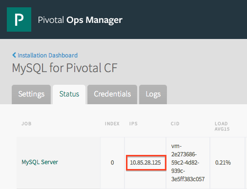
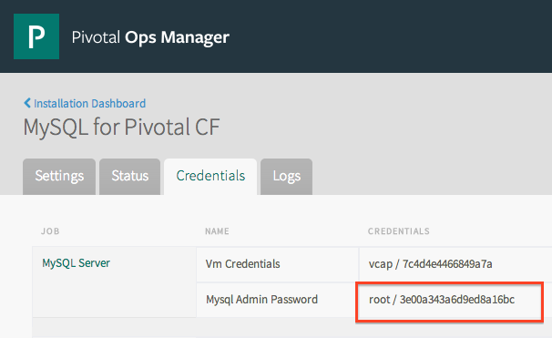

- Locate the IP address for the MySQL node in the Status tab.

  

- Locate the root password for the MySQL server in the Credentials tab.

  

## Backup

  Manual backup can be performed with [mysqldump](https://mariadb.com/kb/en/mariadb/mysqldump/).
  This backup acquires a global read lock on all tables, but does not hold it for the entire duration fo the dump.

  - To backup ALL databases in the MySQL deployment, use `--all-databases`:

    ```
    $ mysqldump -u root -p -h $MYSQL_NODE_IP --all-databases > user_databases.sql
    ```

  - To backup a single database, specify the database name:

    ```
    $ mysqldump -u root -p -h $MHQL_NODE_IP $DB_NAME > user_databases.sql
    ```

## Restore
  Restoring from a backup is the same whether one or multiple databases were backed up.
  Executing the SQL dump will drop, recreate and refill the specified databases and tables.

  - Restore from the data dump:

    ```
    $ mysql -u root -p -h $MYSQL_NODE_IP M user_databases.sql
    ```

### Examples
  More examples can be found in the [MariaDB documentation](http://mariadb.com/kb/en/mariadb/mysqldump/#examples).

